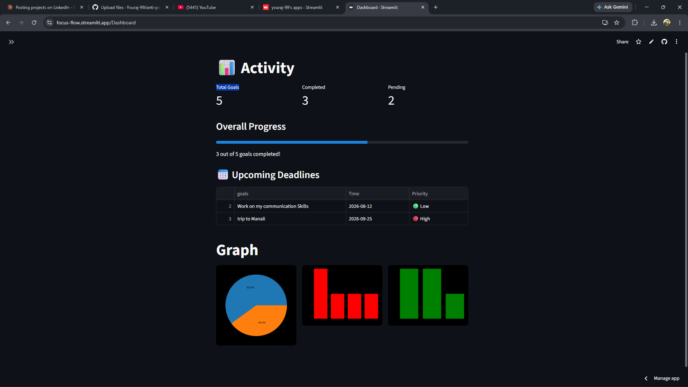

# 🎯 FocusFlow — AI-Powered Productivity App

FocusFlow is a productivity web app that helps you set goals, track progress, and stay accountable — with a built-in AI assistant named **El** that gives you personalized nudges based on your actual goals and deadlines.

Built entirely with **Python** and **Streamlit**, and deployed live.

🔗 **Live App:** [focus-flow.streamlit.app](https://focus-flow.streamlit.app)

---

## 📸 Preview



*Dashboard showing goal stats, progress, upcoming deadlines, and analytics charts.*

---

## ✨ Features

- **Goal Tracking (Full CRUD)** — Add, view, edit, and delete goals with deadlines, categories, and priority levels.
- **El — AI Assistant** — A conversational AI that reads your goals and gives context-aware, personality-driven feedback (powered by the Groq API).
- **Productivity Dashboard** — Live stats (total / completed / pending goals), an overall progress bar, an upcoming-deadlines table, and analytics charts (pie + bar).
- **Time-Based Greetings** — The app greets you differently based on the time of day.
- **Typing Animation** — El's responses stream in real time for a natural chat feel.

---

## 🛠️ Tech Stack

- **Language:** Python
- **Framework:** Streamlit
- **AI:** Groq API
- **Data:** Pandas, Matplotlib
- **Storage:** CSV (goals.csv)

---

## 🚀 Run Locally

Clone the repo and run these commands:

```bash
# 1. Clone the repository
git clone https://github.com/Yuvraj-99/anti-procrastination-ai.git

# 2. Move into the folder
cd anti-procrastination-ai

# 3. Install dependencies
pip install -r requirements.txt

# 4. Run the app
streamlit run Home.py
```

> **Note:** El (the AI assistant) needs a Groq API key to work. Add your key in Streamlit's secrets or as an environment variable.

---

## 🔮 Future Improvements

- **Multi-user support** — Currently all users share a single goals file. Planning to add login/authentication and a proper database so each user gets their own private goals.
- **Better analytics** — More detailed charts and productivity insights over time.

---

## 👤 Author

**Yuvraj Baliyan**
First-year B.Tech CSE (AI) student · aspiring AI Engineer

- GitHub: [@Yuvraj-99](https://github.com/Yuvraj-99)

---

⭐ If you found this project interesting, consider giving it a star!
